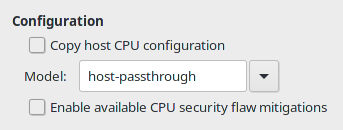

# kvm-passthrough

## What is this repo?

This is my backup of qmeu hooks for running windows 10 under kvm with single-GPU passthrough. All the scripts are based off of [SomeOrdinaryGamers video](https://www.youtube.com/watch?v=BUSrdUoedTo) on setting this up.

## Will these files work for everyone?

**NO!!** This is sort of a template repo and a backup of scripts that work for me. I'll put below what you need to edit in order to get yours working on your machine.

## Is there anything that fully doesn't work?

Sorta. My restart scripts did not properly reload my drivers so until I find a fix, I have it set to restart my entire system when the VM is killed. I recommend removing that line if you know how to properly fix it.

# Extras

## Masking your VM

> This entire section is based on the videos [here](https://www.youtube.com/watch?v=rrlpg6F82S4) and [here](https://www.youtube.com/watch?v=VKh2eKPnmXs) I highly recommend watching those instead of following this part so you can make sure you do everything right for your system

You wanna play BattlEye games? Well follow the steps below until it gets officially supported on [Proton](https://fossbytes.com/steam-deck-valve-working-on-anti-cheat-support-for-proton/)

This is for if you already have a working windows VM. This is a very easy thing to set up. I have my entire xml file in this repo if you wanna base it off of that, but below is all I needed to add to get mine working.

### CPU

First things first, make sure that you set your CPU to be to pass the model to the VM so it doesn't show up as the wrong CPU type.



### XML

After you set that up click on "Overview" and go to XML. Make sure you have XML editing on because we need to do some manual edits in here.

First we need to edit HyperV, edit your HyperV section to look similar to this, if you need extra for your system to work, add it also

```xml
    <hyperv>
      <relaxed state="on"/>
      <vapic state="on"/>
      <spinlocks state="on" retries="8191"/>
      <vpindex state="on"/>
      <runtime state="on"/>
      <synic state="on"/>
      <stimer state="on"/>
      <reset state="on"/>
      <frequencies state="on"/>
    </hyperv>
``` 

Right below that add this section for KVM

```xml
    <kvm>
      <hidden state="on"/>
    </kvm>
```

And below `<vmport state="off"/>` add `<ioapic driver="kvm"/>`

In CPU we need to disable hypervisor and set cache mode to passthrough, so add these lines to the bottom of your CPU section

```xml
    <cache mode="passthrough"/>
    <feature policy="disable" name="hypervisor"/>
```

And finally we need to set the clock area.

```xml
  <clock offset="utc">
    <timer name="pit" tickpolicy="delay"/>
    <timer name="rtc" tickpolicy="catchup"/>
    <timer name="hpet" present="no"/>
    <timer name="tsc" mode="native"/>
    <timer name="hypervclock" present="yes"/>
  </clock>
```

Once all of that is set you should be good to start your VM. Check Task Manager to see if it's detecting it's in a VM and if it's not, then congrats, you now have a stealthy VM, but we're not done yet, just one more thing to do

Open Windows Search and type `Turn Windows features On/Off` and install everything in the first Hyper-V section. Reboot the VM and you're all done.
